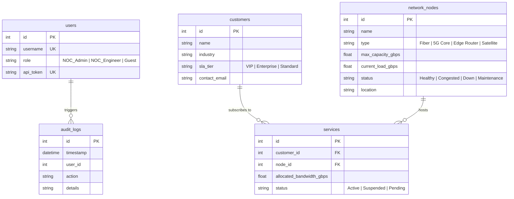

# Nexlink Telecom - MCP Server Lab

A Network Operations Center (NOC) Assistant built for Nexlink Telecom. This project implements the Model Context Protocol (MCP) over a local SQLite database to allow a local LLM to interact safely with telecom database records.

## Database Architecture & ERD

The system uses SQLite (`db/nexlink.db`) with 5 tables: `customers`, `users`, `network_nodes`, `services`, and `audit_logs`.



## Protocol Concerns Implementation

| Protocol Concern | Description | Implementation in server.py |
| :--- | :--- | :--- |
| **Capability Negotiation** | Handshake check | Server declares capabilities in initialize; client verifies before calling tools. |
| **Notifications** | Dynamic tool updates | authenticate_user triggers tools/list_changed to unlock write tools. |
| **Elicitation** | Mid-call human confirmation | upgrade_bandwidth calls ctx.elicit() if upgrade > 3.0 Gbps or customer is VIP. |
| **Sampling** | Server LLM request | analyze_incident_root_cause sends trace log to client LLM via ctx.session.create_message(). |
| **Resources & Prompts** | Exposed policies & prompts | Static policies in policies/ and draft_incident_report prompt template. |
| **Progress Tracking** | Long running task status | run_network_diagnostic calls ctx.report_progress(step, total). |
| **Defensive Tool Design** | Strict validation | Pydantic models with ge/gt bounds, additionalProperties=False, and role checks. |
| **Transport** | Dual transport support | Command line option for stdio and Streamable HTTP. |

## Comparison Note (Read-Only vs Write Tools)

- `get_customer_network_status`: Read-only tool accessible to all roles.
- `run_network_diagnostic`: Read-only tool that emits progress notifications.
- `authenticate_user`: State change tool that pushes tools/list_changed notification.
- `upgrade_bandwidth`: Write tool requiring NOC_Admin role and mid-call elicitation confirmation for VIP upgrades.
- `analyze_incident_root_cause`: Read tool utilizing protocol sampling.

## Transport Choice Justification

- **stdio**: Used for local terminal CLI development for zero-network security.
- **Streamable HTTP**: Used for remote deployment across regional NOC centers behind API gateways.

## How to Run

1. Install dependencies:
   ```bash
   pip install -r requirements.txt
   ```
2. Initialize database:
   ```bash
   python db/setup_db.py
   ```
3. Run test runner:
   ```bash
   python demo_runner.py
   ```
4. Run client CLI:
   ```bash
   python agent/client.py
   ```