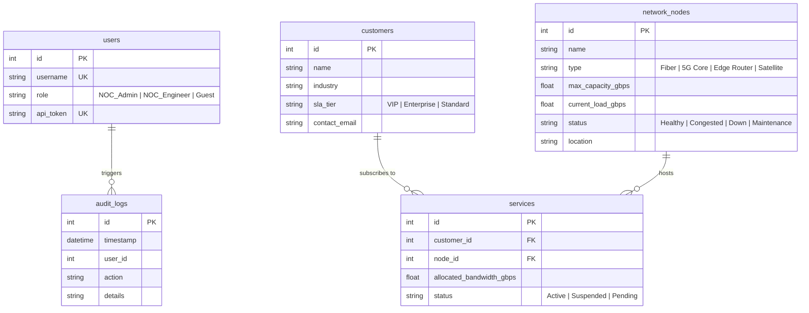

# 📊 Nexlink Telecom Database Entity-Relationship Diagram (ERD)

This document describes the schema architecture for the Nexlink Network Operations Center (NOC) SQLite database.

## Entity Descriptions

1. **users**: Tracks system operators and their role-based access permissions (`NOC_Admin`, `NOC_Engineer`, `Guest`). Used by the MCP server for handler-level authorization and dynamic toolset changes (`tools/list_changed`).
2. **customers**: Enterprise and VIP clients subscribing to telecom infrastructure. The `sla_tier` field determines whether bandwidth modifications trigger mid-call protocol **Elicitation**.
3. **network_nodes**: Physical and virtual network nodes monitored by the NOC. Tracks operational status and real-time bandwidth loads.
4. **services**: Relational mapping linking customers to specific network nodes and allocated bandwidth quotas.
5. **audit_logs**: Immutable audit trail documenting state changes, bandwidth upgrades, and security approvals.
